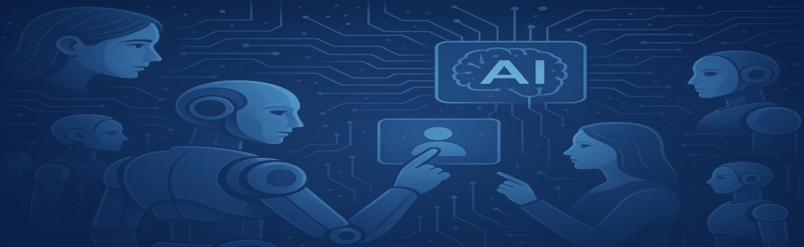

## Learning Agents Research Collective (LARC)
---

<!-- ### Welcome to internal website of LARC -->

Welcome to the internal website of LARC! This platform acts as the central knowledge base for our research group, providing essential resources and information. It aims to facilitate a smooth onboarding process for new students, ensuring they have the necessary tools and guidance to integrate into the group. The site also serves as a comprehensive documentation hub for our ongoing research activities, keeping everyone informed and engaged with our latest developments.

 
 

### Group Calendar:
---

<iframe src="https://calendar.google.com/calendar/embed?height=600&wkst=2&ctz=Asia%2FKolkata&showPrint=0&src=cmxncm91cC5paXRkQGdtYWlsLmNvbQ&src=ZW4uaW5kaWFuI2hvbGlkYXlAZ3JvdXAudi5jYWxlbmRhci5nb29nbGUuY29t&color=%23039be5&color=%230b8043" style="border:solid 1px #777" width="1000" height="600" frameborder="0" scrolling="no"></iframe>

  

<b>THIS WEBSITE IS INTENDED EXCLUSIVELY FOR INTERNAL USE BY OUR TEAM.</b>

<!-- 
<b>This website is intended exclusively for internal use by our team.</b>
 -->